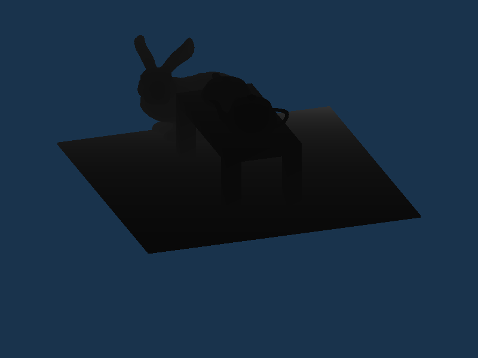
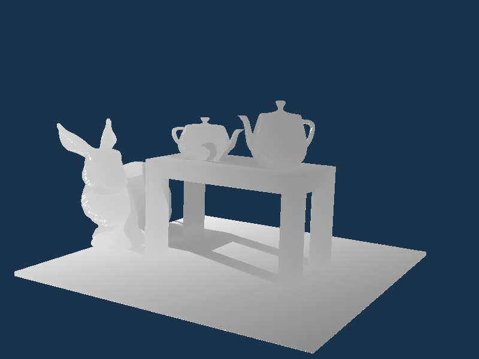
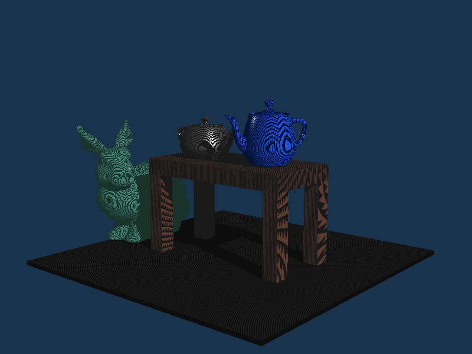
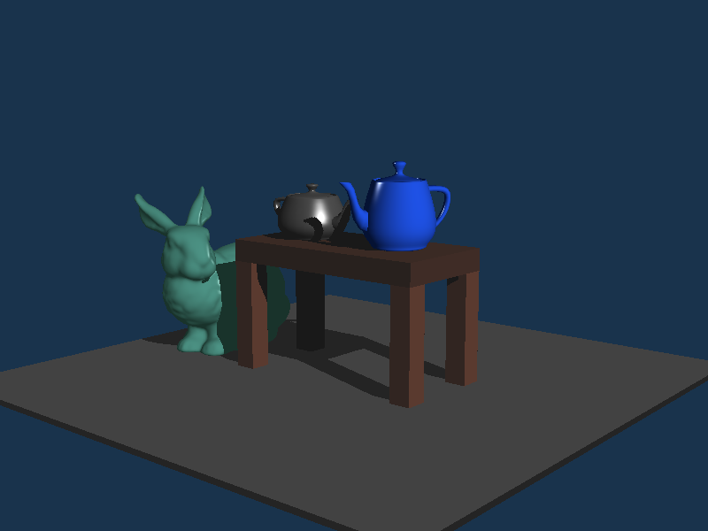
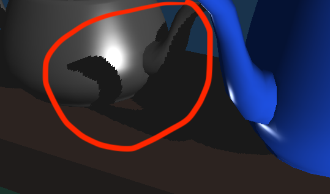
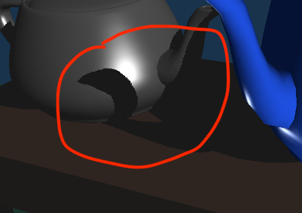

# Shadow Mapping, Final Writeup | Ryan Nishimoto

## Introduction
This writeup will be broken up into three main sections, one where I explain
how shadow mapping works, one explaining implementation, and then one where I document the development and showcase results.

[Showcase video](https://youtu.be/OsZ_bRDxQ8g)

## About Shadow Mapping
Shadow mapping is a technique in rasterization that uses two passes of rendering to create the effect of shadows.
The first pass the rasterizer renders the scene from the point of view of the light. It stores the depth information
encoded as color in a texture buffer for the second pass. During the second pass, shader can use the depth information
from the texture to determine if a fragment is in a shadow. To determine if a fragment is in a shadow, compute the distance
from the fragment to the light source and compare it with the value stored at the corresponding pixel in the texure.
If the depth of the fragment is much greater than the value stored from the initial render, then there is another fragment
that is closer to the light so therefore the current fragment is in a shadow.

## Design
The core structure of the OpenGL pipeline and scene rendering is copied from HW3
with a few modifications to support the two pass rendering.

### Main.cpp
The main loop for displaying was modified to render from the light view to the
texture and then to the main screen using the shadows. Several static globals
were added to store the depth map texture. In the initialize function, the depth map
frame buffer and texture is set up.

### Scene.inl
Small tweaks were made to the scene such as adding a floor and making there only be
one light source. Create and initialize a DepthShader.

### Scene.cpp
A new function drawDepth was written which is a copy of the DFS stack method but
is used for the depth rendering. The drawing loops keep track of model transforms
instead of modelview transforms since there are two views. In the draw function,
sets the correct shader and then sets the attributes of the shader. New attributes
were added for the light projection and view matrices.

### Scene.h
Additional class member for the depth shader was added. Made the attribute Light
a single pointer since there will not be more than one light source.

### DepthShader.h
Heavily based off SurfaceShader.h. Contains functions for initializing and setting
uniforms.

### SurfaceShader.h
Added new uniforms for the light projections, light view, texture, and toggling depth map shading.
The uniform attributes about the light properties were changed to be single values instead of vectors
since there is only one light.

### Light.h
Added two new attributes for the view and projection matrices of the light. Function to
compute them added to be called once light's position and colors are properly set.
Use orthographic projection with `glm::ortho` to calculate the projection.
Use `glm::lookat` to calculate the view.

### depth.frag
Simple fragment shader that shades based on a linearized z coordinate value.
Used to store the depth information in the texture.

### lightspace.vert
Simple vertex shader that forwards the position of objects based on the light
projection and view.

### lighting.frag
Modified to support shadow shading. If toggled to shade by depth map, shades
fragment color from cooresponding pixel in texture map. If toggled to shade shadows,
calculates whether the fragment is in a shadow with bias values based on the angle of
the surface normal and light to smooth out shadow acne. Shades ambient contribution if in shadow, otherwise
shades based on Blinn-Phong shading from HW3.

### projective.vert
Modified to have the new uniforms for the light view and light projection. The shader
also now outputs the coordinates of in the light space as well

## Implementation
### Initial modifications to HW3
After copying my work from HW3, the first step was to modify the scene for shadows.
I added a floor to the scene and removed the lightbulb cube since there would only be one
light source. I also moved the light further away so that the FOV from the light wouldn't
be super wide and distort the depth map.

### Shading by depth
Wrote a simple fragment shader that output the RGB values of color based on depth.
Rescaled the values so that the shading was not all one color using the following formula
```
float ndc_z = 2 * gl_FragCoord.z - 1;
float lin_z = (2.0 * near * far) / (far + near - ndc_z * (far - near)); 
fragColor = vec4(vec3(lin_z / (far - near)), 1.0f);
```
To test this shader, I replaced the fragment shader that was compiled in the SurfaceShader
class created in Scene.inl.

### Render from light space
To render from the light space, program another vertex shader that uses the light view
and light projection to output the position. lightspace.vert is a simple vertex shader
with uniforms for the light view, light projection, and model. It outputs the transformed
coordinate.

The Light class in Light.h had a view and projection attribute added which store
the values of the light space view and light space projection. There is also a function
`calculate()` which is to be called after the position of the light is set in Scene.inl.
I struggled quite a bit with this part since I did not know to use `glm::ortho()` to compute
the matrix. Using the view matrix calculations from the lecture slides rendered a good image
to the main screen, but I was unable to use the info from the rendering later when testing
for shadows.

To compile and use the shader, I created a DepthShader class in DepthShader.h.
This was heavily based off SurfaceShader.h and inherits Shader.h which handles the OpenGL
compiling. SurfaceShader and DepthShader keep local variables of the actual uniform
type and GLuint values which store the location of the uniform in the shaders. There
are functions to initialize and set the uniform values.

I added an instance of DepthShader to Scene.h. Then in Scene.inl, instantiated 
the shader and called the member functions to compile and initialize uniforms.
After adding the Light to the scene, I made sure to call `light -> calculate()`
to compute the light view and projection matrices.

To use the DepthShader, I added another method `drawDepth()` to Scene.cpp.
This method followed the same DFS loop with the matrix stack as `draw()` from HW3.
The modelview matrix is instead just the model matrix and the shader used is the
DepthShader class. The method sets the view and projection based off of the attributes
of Light.

Finally, to test this stage, I swapped out the `draw()` call in main.cpp to `drawDepth()`.
The inital image that was generated was zoomed out too far and had no gradient. I adjusted
the values of the `glm::ortho()` function call until I got the result below.



The parameters I settled on was
```
near = 0.15f
far = 10.0f
```

### Render to the Texture
To render to a texture, I followed the code given in the project writeup. I decided to
store and initialize the texture map in main.cpp. Modifications were made to the `display()`
loop so that first it binds to the texture map buffer and uses the depth shader, then
uses the regular shader on the main screen.

The SurfaceShader's fragment shader needs the info about the light space position
so that it can compute the corresponding pixel in the texture map to get at the sampled
depth. To do this, modifications were made to the SurfaceShader class to include the light
space projection and view matrices.  Additionally in the `draw()` dfs loop, the modelview
stack was changed to the model transformation stack. This way the vertex shader could
compute both the camera view coordinates and the light view coordinates for the
fragment shader.

To sample the values from the texture I used a `Sampler2D` in the projective.vert
file from HW3. To get the value of the pixel in the texture map cooresponding to the
current fragment position, I did the following calculation.
```
 vec3 l_pos = positionLS.xyz / positionLS.w; // normalize the light position
l_pos = l_pos * 0.5 + 0.5; // scale the position from [0,1] since that is the range of texturemap
```
This part was very difficult to debug since I was running into issues where I was unable to read any
meaningful values from the texture map which was the result of not using `glm::ortho()`.
Since I was doing a perspective projection matrix for the light based off of the
lecture slides, the tranformation from light position to the screen needed to be the
inverse of the perspective projection to get the proper pixel value. I finally narrowed
down the issue after figuring out that my lightposition values passed in to the fragment
shader were correct by shading by their values. I came across some talk on Piazza about `glm::ortho()`
which confirmed that I was doing all of my light space transformations correctly, but
had the wrong projection matrix. After fixing the projection, I was able to
wire the lighting.frag shader to shade based off the value sampled in the depth map.



### Testing for Shadows
Testing for shadows in the shader is simply using a boolean comparison against the scaled
z value of the light coordinate and the sampled value stored in the texture map.
If the fragment was further away from the light than the sampled value in the depth map
then it is blocked. Shade the blocked fragments with only their ambient components.
The rest can be shaded using the standard Blinn-Phong shading.

### Shadow Acne
The results of just doing the boolean comparison with the scaled z value led to
a scene with lots of Moire patterns or shadow acne.



This is caused by the texture map being a discrete space and the fragment positions
being in a continuous space which causes weird rounding at the pixel borders. To fix this
I added a bias using the formula from the writeup
```
float bias = max(0.05 * (1.0 - dot(normal, lightVec)), 0.005);
```
This formula uses the dot of the surface normal and direction to the light to
calculate the angle between them. The theory is that the smaller the angle between
the surface normal and the light, the more fragments will map to the same pixel.

The render after introducing bias(I also made the floor bigger to make the shadows easier to see)



### Sampleing issues
There is pixelation at the far edges of the shadow due to there being more pixels
in the texture being related to fragments closer to the light source. This can be
partially remedied by doubling the resolution of the texture map from 1024x1024
to 2048x2048.

1024x1024



2048x2048



This helps make the pixelation less noticable. However implementing PSM or LiSPSM
would be the better solution and will give smoother outlines for the same resolution texture.